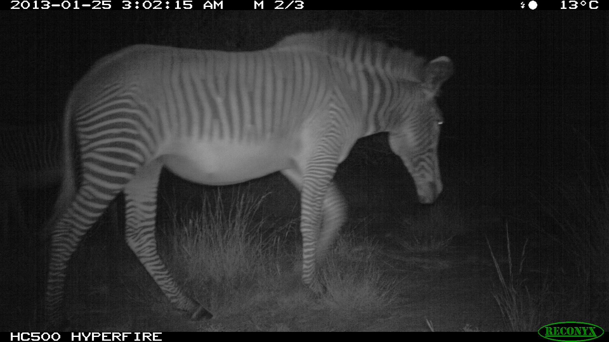

```{r setup, include=FALSE}
knitr::opts_chunk$set(echo = TRUE)
```

## TL;DR
I used data from [iWildCam 2020](https://www.kaggle.com/c/iwildcam-2020-fgvc7/overview) Kaggle competition to practice machine learning vision after completing [fast.ai's](https://course.fast.ai/) deep learning course.
I managed to build a solution that achieved 78% accuracy on the test set in classifying animals on the camera trap photo, which places the solution in the top 10% of this competition (10/126).
I built two models: the first model is a ResNet50 on the original images but resized, with moderate data augmentation, mixup and TTA, the second model is also ResNet50 built on the cropped images to bboxes detecting the animals. Predictions were aggregated with probabilities from the original images' model weighted with 0.3 and 0.7 for cropped model predictions. Finally, the predictions were grouped using location and timestamp into sequences and the majority class was assigned to the whole sequence as a final prediction.


*Zebra captured by the camera. Picture from the test set.*

## Data pre-processing
The goal of 2020 iWildCam competition was to classify animals on the camera trap pictures. The created solution should work accurately on the pictures taken in the new locations.
Data provided by the competition organizers had large resolution and had to be resized before the analysis to speed up training time. There is also no need to train a model on large resolution images. I used the [dataset](https://www.kaggle.com/qitvision/iwildcam2020-256) shared by the Joni Juvonen with images resized to 256x256. Many thanks for sharing this data publicly with others.
Additionally, I created [dataset](https://www.kaggle.com/lennyom/iwildcam2020-animal-crops) and cropped original images to bboxes provided by the detector model (provided as competition data). I cropped images to bbox above 30% prediction confidence.

## Data augmentation
I used a random rotation of 20 degrees, random zoom and perspective warping and adjusted brightness and contrast both in the full images and crops. I used reflection padding and normalized data to ImageNet stats.

## Models
I built two vision models using fastai v1. The first model was built on the original images resized to 128x128. I trained a [ResNet50](https://www.quora.com/What-is-the-deep-neural-network-known-as-%E2%80%9CResNet-50%E2%80%9D?share=1) using [one cycle policy](https://sgugger.github.io/the-1cycle-policy.html) and [mixup](https://arxiv.org/abs/1710.09412) 10 epochs with a frozen body, and the next 10 epochs where all the model weights were retrained.
The second model was also ResNet50 trained on cropped images, resized to 128x128, using one cycle policy 12 epochs with a frozen body, and the next 12 epochs where all weights were updated.
I tried mixed precision and progressive resizing and increase the resolution of the photos to 256x256, but that didn't improve the results for the second model.

## Predictions
Predictions were made using test time augmentation for both models. I aggregated the probabilities from 2 models using the formula `0.3 * probabilities from model 1 + 0.7 * probabilities from model 2`. For images with no predictions from the second model (lack of bbox or too low confidence) I only toke predictions from the first model. Finally, I grouped the predictions into sequences which I created using photo location info and timestamp. For each sequence, I selected the majority class in a sequence as a prediction label.

## Code

I trained the models using Kaggle's kernels.
Notebook for the model on the original images resized to 128x128 is [here](https://www.kaggle.com/lennyom/iwildcam-2020-using-fastai-resnet50-mixup-and-tta).
Notebook for the second model on cropped images is [here](https://www.kaggle.com/lennyom/iwildcam2020-fastai-on-cropped-images).
Kernel aggrehating the results [here](https://www.kaggle.com/lennyom/output-aggregation).

## Acknowledgments
Many thanks to fastai's authors for creating amazing learning resources and a deep learning powerful library. 